# 블로그 시퀀스 다이어그램

> 참여자 범례
> - **User** : 브라우저(사용자)
> - **Astro** : 프론트엔드 페이지 (SSR 서버 / 클라이언트 스크립트)
> - **Express** : 백엔드 API 서버 (Node.js)
> - **Middleware** : Auth 미들웨어
> - **Controller** : 컨트롤러 (비즈니스 로직)
> - **Service** : 서비스 레이어 (DB 쿼리)
> - **DB** : PostgreSQL

---

## 1. 홈 페이지 방문 (`GET /`)

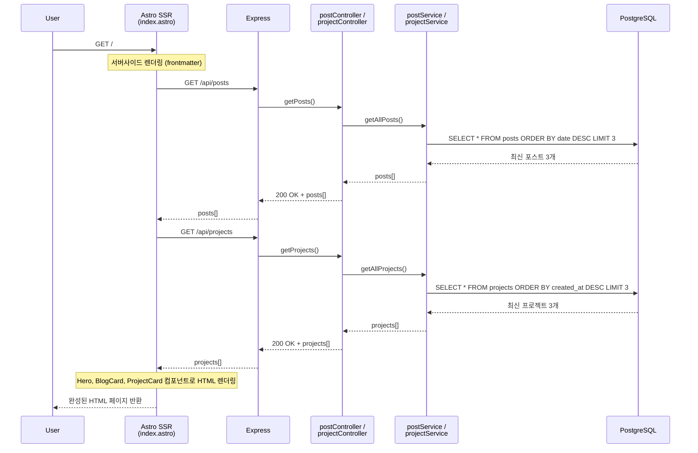

---

## 2. 블로그 목록 조회 (`GET /blog`)

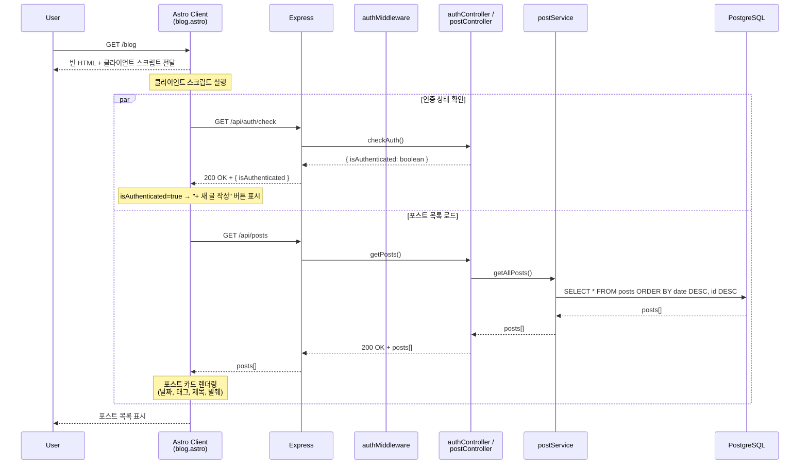

---

## 3. 블로그 글 상세 조회 (`GET /blog/[slug]`)

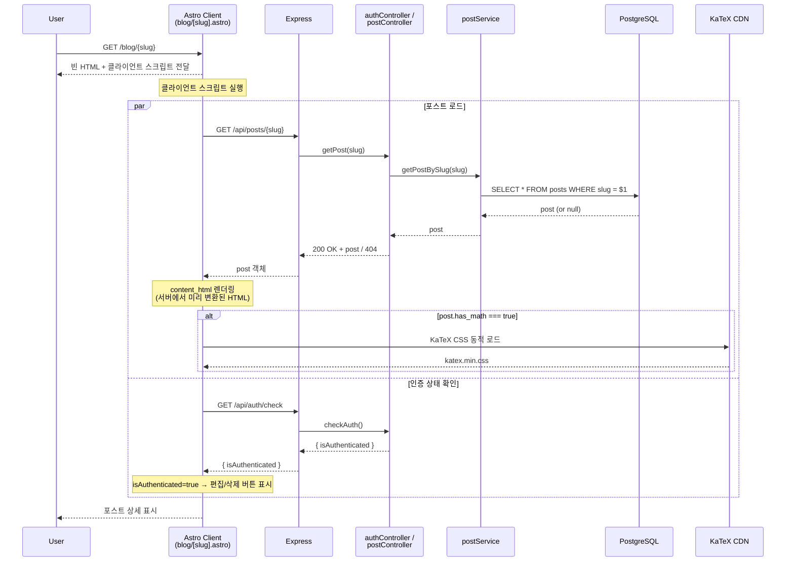

---

## 4. 로그인 (`POST /api/auth/login`)

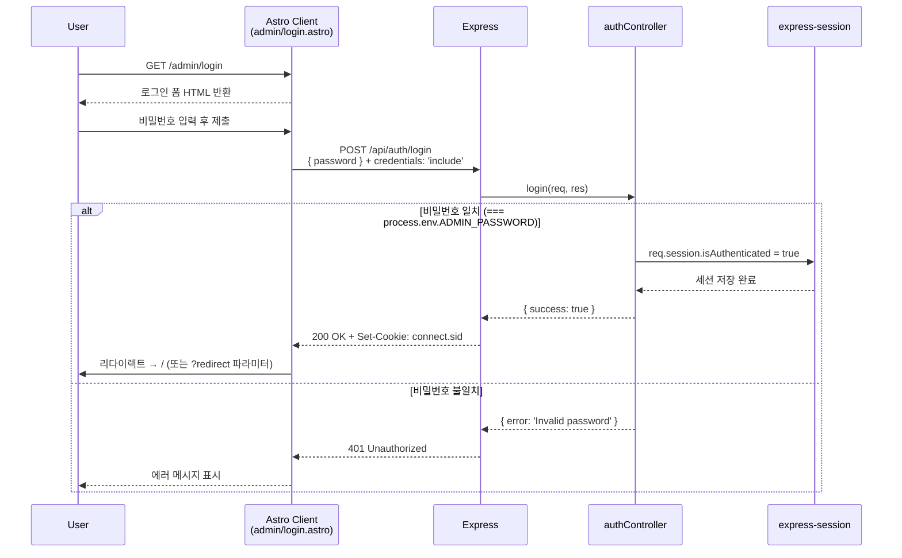

---

## 5. 블로그 글 작성 (`POST /api/posts`) — 인증 필요

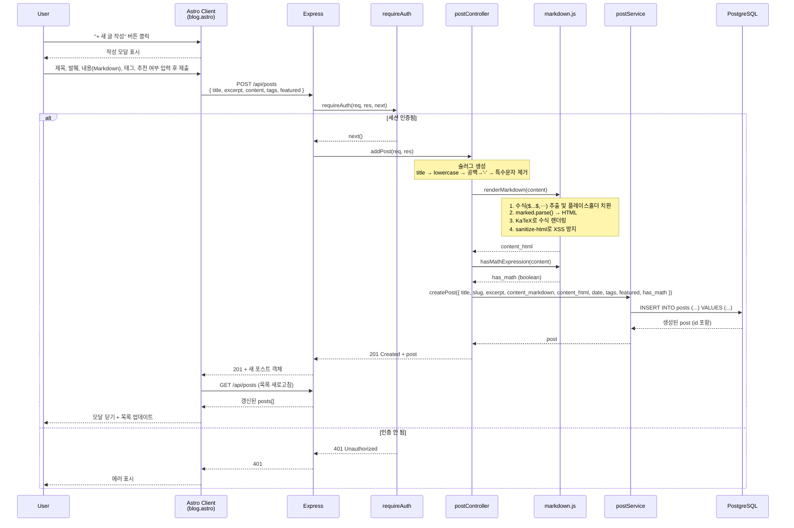

---

## 6. 블로그 글 수정 (`PUT /api/posts/:id`) — 인증 필요

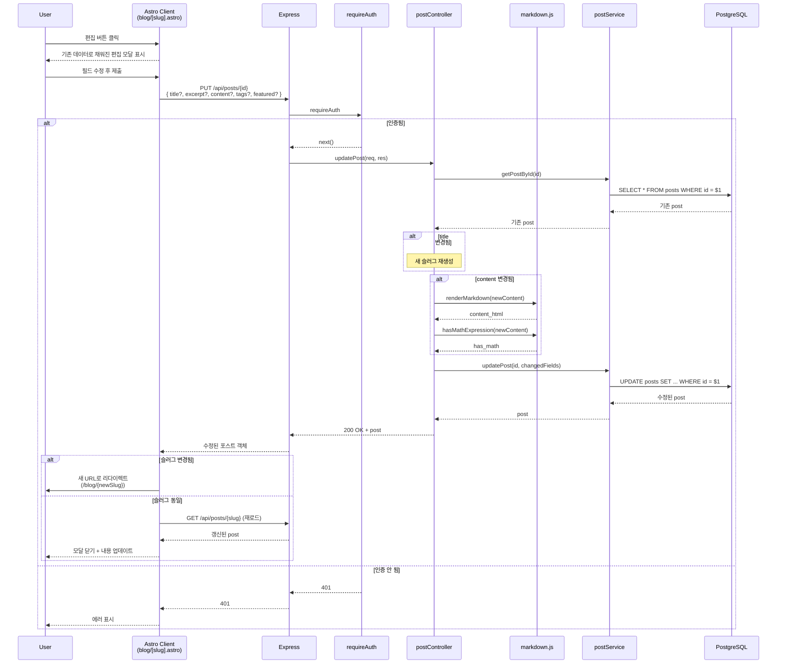

---

## 7. 블로그 글 삭제 (`DELETE /api/posts/:id`) — 인증 필요

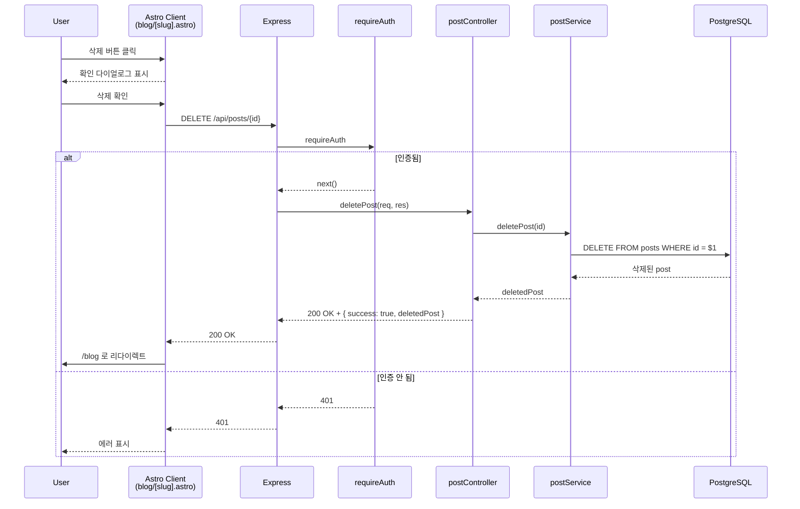

---

## 8. 프로젝트 목록 조회 (`GET /projects`)

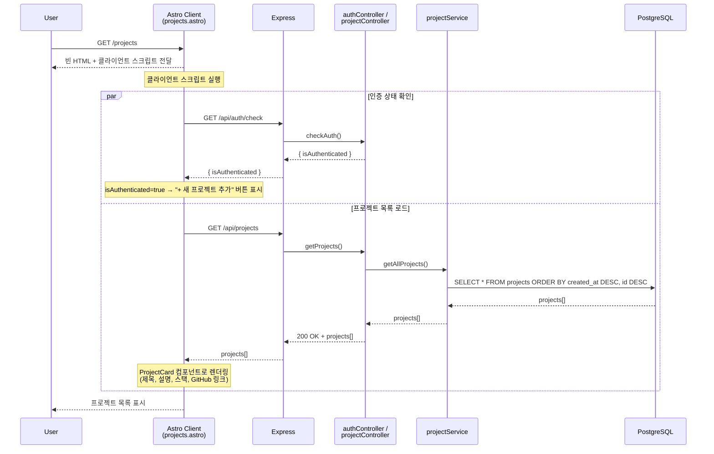

---

## 9. 프로젝트 상세 조회 (`GET /projects/[id]`)

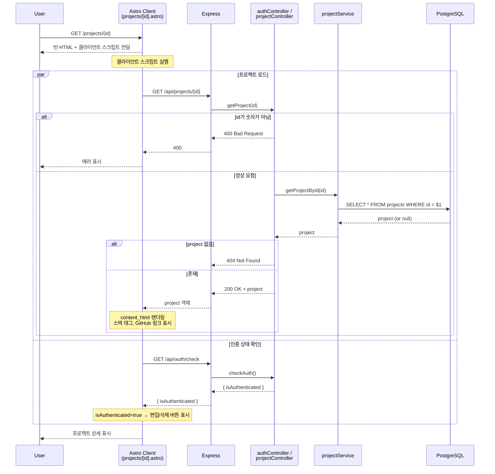

---

## 10. 프로젝트 추가 (`POST /api/projects`) — 인증 필요

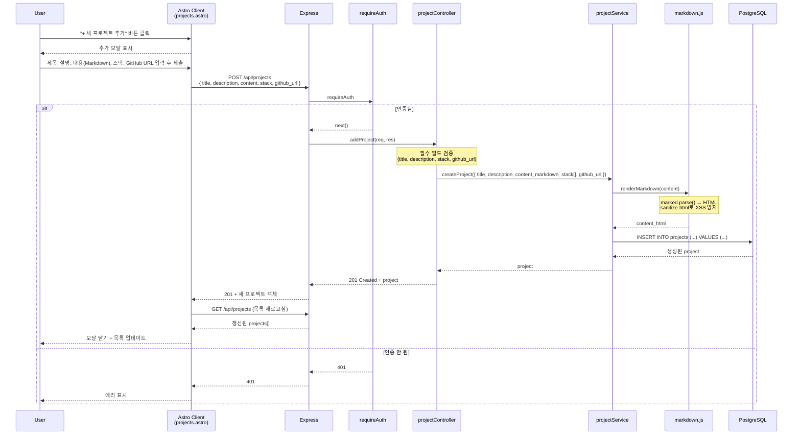

---

## 11. 프로젝트 수정 (`PUT /api/projects/:id`) — 인증 필요

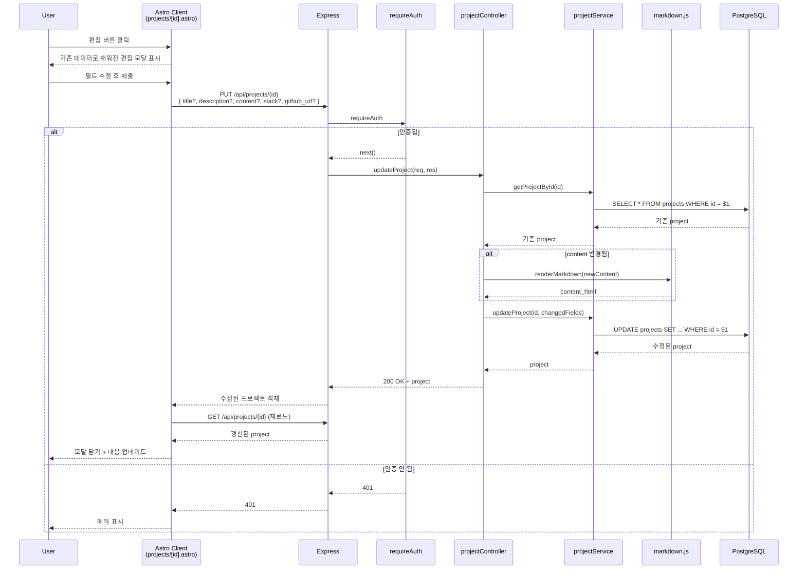

---

## 12. 프로젝트 삭제 (`DELETE /api/projects/:id`) — 인증 필요

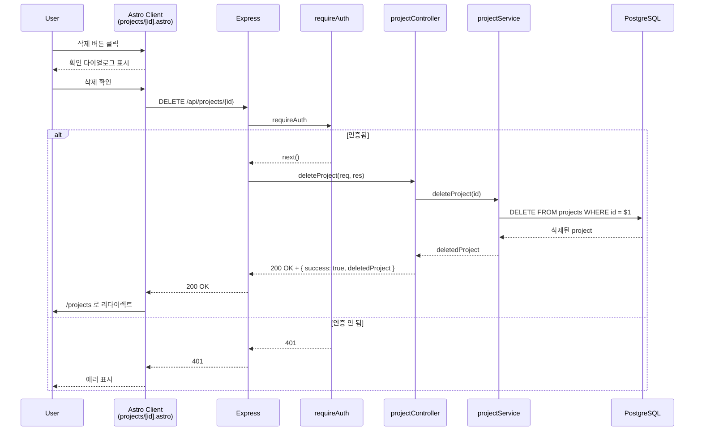

---

## 처리 위치 요약표

| 요청 종류 | 클라이언트 (브라우저) | 프론트 서버 (Astro SSR) | 백엔드 (Express) | DB |
|---|---|---|---|---|
| 홈 페이지 방문 | HTML 수신 | `index.astro` SSR 렌더링 | `/api/posts`, `/api/projects` | SELECT |
| 블로그 목록 조회 | `checkAuth()`, `loadPosts()` | — | `/api/auth/check`, `/api/posts` | SELECT |
| 블로그 글 상세 조회 | `loadPost()`, `checkAuth()` | — | `/api/posts/:slug`, `/api/auth/check` | SELECT |
| 로그인 | 폼 제출 | — | `/api/auth/login`, 세션 생성 | — |
| 블로그 글 작성 | 모달 폼 제출 | — | `/api/posts` (POST), 마크다운 렌더링 | INSERT |
| 블로그 글 수정 | 모달 폼 제출 | — | `/api/posts/:id` (PUT), 마크다운 재렌더링 | UPDATE |
| 블로그 글 삭제 | 삭제 확인 | — | `/api/posts/:id` (DELETE) | DELETE |
| 프로젝트 목록 조회 | `checkAuth()`, `loadProjects()` | — | `/api/auth/check`, `/api/projects` | SELECT |
| 프로젝트 상세 조회 | `loadProject()`, `checkAuth()` | — | `/api/projects/:id`, `/api/auth/check` | SELECT |
| 프로젝트 추가 | 모달 폼 제출 | — | `/api/projects` (POST), 마크다운 렌더링 | INSERT |
| 프로젝트 수정 | 모달 폼 제출 | — | `/api/projects/:id` (PUT), 마크다운 재렌더링 | UPDATE |
| 프로젝트 삭제 | 삭제 확인 | — | `/api/projects/:id` (DELETE) | DELETE |

> **핵심 특이점**
> - 홈 페이지(`/`)만 Astro SSR에서 API를 직접 호출해 서버에서 렌더링
> - 나머지 모든 페이지는 클라이언트 JS가 직접 Express API를 `fetch()`로 호출
> - 마크다운 → HTML 변환은 항상 **백엔드(Express)**에서 수행되어 DB에 저장
> - 수학식 포함 여부(`has_math`)가 true일 때만 KaTeX CSS를 CDN에서 동적 로드
> - 인증은 세션 쿠키(`connect.sid`)로 관리, 로컬호스트는 자동 인증(`autoAuth` 미들웨어)
